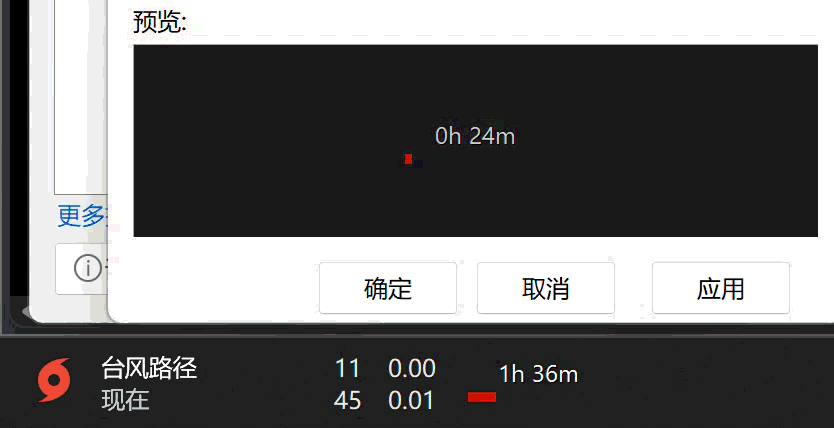
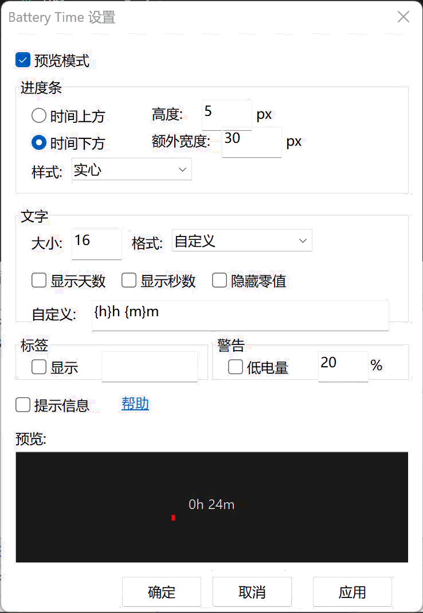

# TrafficMonitor 插件集

| 插件 | 说明 | 文档 |
|------|------|------|
| BatteryTime | 电池剩余时间（+番茄钟模式） | 见下文 |
| AILimit | AI 额度（Go/OpenRouter/DeepSeek） | [Plugins/AILimit/README.md](Plugins/AILimit/README.md) |

---

# BatteryTime - TrafficMonitor 电池剩余时间插件

用于在任务栏显示电池剩余时间的 TrafficMonitor 插件，支持进度条、自定义格式、深色/浅色模式自动适配。




## 功能

- 电池剩余时间显示（放电状态，充电时自动隐藏）
- 进度条显示电量百分比（实心 / 渐变 / 圆点 三种样式）
- 1:1 实时预览（设置即所见，无需重启）
- 深色 / 浅色模式自动适配（读取 Windows 主题设置）
- 自定义时间格式（支持 `{d}{h}{m}{s}` 变量，零填充 `{h:02}`）
- 低电量文字警告（低于阈值时文字变红）
- Tooltip 详细信息（鼠标悬浮显示电量百分比 + 剩余时间）
- 文字阴影（深浅任务栏都清晰）
- 平滑渐变颜色（电量从绿到黄到红连续过渡）

## 安装

1. 从 [Release](https://github.com/Mariomoprc/TrafficMonitorPlugins/releases/tag/BatteryTime_V1.00) 下载 `BatteryTime.dll`
2. 放到 TrafficMonitor 所在目录的 `plugins` 文件夹下（没有就创建）
3. 重启 TrafficMonitor
4. 右键任务栏 → **显示设置** → 找到 **Battery time** → 勾选启用

## 设置

右键任务栏 → **显示设置** → 找到 **Battery time** → 点击 **"插件选项"**

### 进度条设置

| 选项 | 说明 | 默认值 |
|------|------|--------|
| 位置 | 进度条在时间上方 / 下方 | 时间下方 |
| 高度 | 进度条粗细（像素） | 5 px |
| 额外宽度 | 进度条比文字宽多少像素 | 30 px |
| 样式 | 实心 / 渐变 / 圆点 | 渐变 |

### 文字设置

| 选项 | 说明 | 默认值 |
|------|------|--------|
| 大小 | 时间文字字体大小 | 16 |
| 格式 | 预设格式或自定义 | Xh Xm |
| 显示天数 | 长续航时显示天数 | 关 |
| 显示秒数 | 短续航时显示秒数 | 关 |
| 隐藏零值 | 1h 0m 显示为 1h | 关 |
| 自定义格式 | 用户自定义格式字符串 | {h}h {m}m |

### 自定义格式变量

| 变量 | 含义 | 示例 |
|------|------|------|
| `{d}` | 天数 | `1` |
| `{h}` | 小时 | `6` |
| `{h:02}` | 小时（零填充） | `06` |
| `{m}` | 分钟 | `24` |
| `{m:02}` | 分钟（零填充） | `24` |
| `{s}` | 秒数 | `30` |
| `{s:02}` | 秒数（零填充） | `30` |

**预设格式示例：**

| 格式名 | 格式字符串 | 显示效果 |
|--------|-----------|---------|
| Xh Xm | `{h}h {m}m` | 6h 24m |
| X:MM | `{h}:{m:02}` | 6:24 |
| HH:MM | `{h:02}:{m:02}` | 06:24 |
| X小时X分 | `{h}小时{m}分` | 6小时24分 |
| Xd Xh Xm | `{d}d {h}h {m}m` | 1d 6h 24m |
| Xm Xs | `{m}m {s}s` | 24m 30s |
| 自定义 | 用户输入 | 自由组合 |

### 其他设置

| 选项 | 说明 |
|------|------|
| 标签 | 在时间前加标签（如 "剩余: 6h 24m"） |
| 低电量警告 | 低于阈值时文字变红色（默认 20%） |
| 提示信息 | 鼠标悬浮时显示详细 Tooltip |
| 预览模式 | 开启后任务栏模拟电量变化循环（100→80→50→20→5%） |

## 技术特点

- 使用 `IOCTL_BATTERY_QUERY_STATUS` 直接读取电池控制器原始数据（mWh/mW），精度高于 `GetSystemPowerStatus`
- 多电池自动聚合（双电池笔记本）
- EMA 平滑滤波（α=0.3），防止瞬时功率跳变导致显示抖动
- IOCTL 失败时自动回退到 `GetSystemPowerStatus`
- Windows 主题注册表检测，自动切换深色/浅色模式文字颜色
- 基于对话框的实时预览，使用与任务栏 1:1 等比绘制

## 构建

需要 Visual Studio 2022 + Windows 10 SDK + MFC 库（Build Tools 需安装 ATL/MFC 组件）。

```powershell
msbuild TrafficMonitorPlugins.sln /p:Configuration=Release /p:Platform=x64 /t:BatteryTime
```

输出文件：`Bin\x64\Release\BatteryTime.dll`

## 版本

* **V1.00** - 初始版本
* 下载：[Release BatteryTime_V1.00](https://github.com/Mariomoprc/TrafficMonitorPlugins/releases/tag/BatteryTime_V1.00)

## 许可证

MIT License
